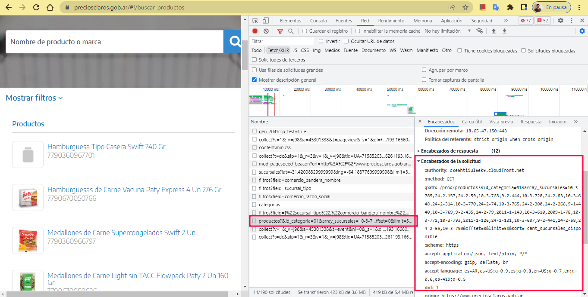
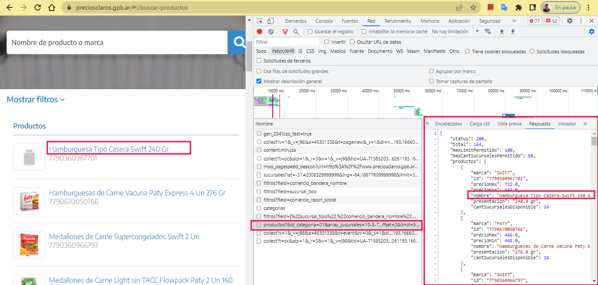

layout: true


```{r setup, include=FALSE}
options(htmltools.dir.version = FALSE)
knitr::opts_chunk$set(collapse = TRUE,
                      fig.retina = 3,
                      cache = TRUE,
                      warning = FALSE,
                      message = FALSE)

library(fontawesome)
library(httr)

```


```{r xaringan, include=FALSE}
xaringanExtra::use_xaringan_extra(c("tile_view", "animate_css", "tachyons", "extra_styles", "scribble", "editable", "broadcast", "webcam"))
```

```{r extrasXaringan, echo=FALSE}
xaringanExtra::use_extra_styles(
  hover_code_line = TRUE)
xaringanExtra::use_progress_bar(color = "#00a6a9", location = "top")

options(scipen = 999)


```


---
class: inverse, center, middle

# SCRAPING

---
class: left, top

  Esta presentación está basada en el libro de [Introduction to Web Mining for Social Scientists de Ulrich Matter](https://umatter.github.io/webmining/).

---

class: center

## ¿Qué es web scraping?

`r knitr::include_graphics('https://cdn-media-1.freecodecamp.org/images/1*BrUAg3-OqIHkoTz_CRIzTA.png')`

---

*Recolección programática de información a partir de fuentes web.*

- **Recolección**: implica en cierto grado la reunión de elementos dispersos.

- **Programática**: Se realiza mediante programas que se ejecutan sistemáticamente para cada elemento.

- **Fuentes Web**: información disponible en una página web (de cualquier tipo).


---

¿Por qué usar web scraping?

- Permite automatizar procesos `r fa("robot", fill = "blue")`

- Mayor velocidad de recolección `r fa("gauge-high", fill = "green")`

- Estandarización del proceso `r fa("ruler-combined", fill = "black")`

- Reproductibilidad del proceso (al menos formalmente) `r fa("arrow-rotate-right", fill = "purple")`

---

## ¿Qué vamos a ver?

Ejemplos de Web scraping desde R:

- Scraping de paginas web estáticas

- Consulta de APIs (no suele considerarse scraping pero es muy útil)

- Selenium desde R


---

##Algunas advertencias generales a tener en cuenta:

- 1. No siempre está permitido por el propietario de la web `r fa("ban", fill = "red")` 

- 2. No siempre conviene en términos de costo beneficio `r fa("scale-unbalanced", fill = "orange")`

- 3. Conlleva riesgos de ciberseguridad para quien lo realiza `r fa("bug", fill = "yellow")` `r fa("bug", fill = "yellow")`

- 4. Conlleva riesgos para la web scrapeada `r fa("weight-hanging", fill = "gray")` 


---

##¿Cómo afrontar esas advertencias?

**CONOCER LO QUE VAMOS A SCRAPEAR**
1. Chequear TyC o consultar con admins de la web.
2. Evaluar costos/beneficios (en tiempo y recursos).
3. Revisar si hay amenazas en la web objetivo.
4. Sopesar carga viable y moderar frecuencia de consultas.
6. Estimar costos y el volumen de scraping necesario para nuestro objetivo

---
class: inverse, center, middle

# Web Estática

---
class: justify, middle

**HTTP** 
- (Hypertext Transfer Protocol) es el nombre de un protocolo de intercambio de datos en la Web. *Clientes* y *servidores* se comunican intercambiando mensajes individuales. 

- Los mensajes que envía el cliente, normalmente un navegador Web, se llaman peticiones (*request*), y los mensajes enviados por el servidor se llaman respuestas (*response*).

---

class: center

# HTTP

`r knitr::include_graphics("https://developer.mozilla.org/en-US/docs/Web/HTTP/Overview/fetching_a_page.png")`

---

**GET** y **POST** son los dos metodos más comunes de peticiones HTTP.

- GET: realiza una solicitud pero no envía datos: no tienen body.
- POST: realiza una solicitud que implica el envío de datos: tienen body.

Cuando realizamos una solicitud obtenemos un **estatus** de respuesta:

- Respuestas informativas (100–199)
- Respuestas satisfactorias (200–299)
- Redirecciones (300–399)
- Errores de los clientes (400–499)
- Errores de los servidores (500–599)

---

Una petición HTTP es lo que suele ocurrir cuando tipeamos una **URL**


---

El primer elemento suele ser nuestra primer peticion (comparar con lo siguiente)


---

Podemos hacer la misma peticion desde R

```{r}
GET(url = "https://www.preciosclaros.gob.ar/#!/buscar-productos")
```

---

A tener en cuenta de las peticiones HTTP:

- *Metodo*: GET/POST

- *Headers*: información adicional de la solicitud/respuesta

- *Estatus*: codigo de situación de la solicitud

- *Contenido de la respuesta*: en general text/html pero también otros como application/json

---

# HTML y CSS

- **HTML** (HyperText Markup Language por sus siglas en inglés) es un lenguaje descriptivo que especifica la estructura de las páginas web.


- **CSS** de las siglas en inglés Cascading Style Sheets es un lenguaje declarativo que controla el aspecto de las páginas web en el navegador.

https://developer.mozilla.org/es/docs/Learn/Getting_started_with_the_web 

---

### **HTML** se usa para anotar contenido y definir la jerarquía del contenido en un documento indicandole al navegador cómo mostrar ('renderizar') este documento en la pantalla.

Podemos pensar un documento HTML como un diagrama de árbol

.center[

]

---
### Comparar el diagrama anterior con:

```{html}
<html lang="en-US">
  <head>
    <meta charset="utf-8" />
    <title>My title</title>
  </head>
  <body>
    <a href="url">Link</a>
    <h1>My header</h1>
  </body>
</html>
```


---

- Los sitios web además usan **CSS** que permite diseñar la estética del contenido HTML.  **CSS**  opera definiendo propiedades y clases para formatear el contenido.

- Esto facilita sustancialmente la extracción de contenido específico de sitios web grandes y complejos.

```{html}
  <body>
    <a href="url">Link</a>
    <h1>Titulo</h1>
      <div><p class="texto importante">Palabras</p></div>
      <div><p>Palabras</p></div>
    <h2>Segundo Titulo</h1>
      <div><p class="texto importante">Palabras</p></div>
      <div><a href="url" class="texto importante">Palabras con link</a></div>
  </body>
```

---
class: middle, center
## Scripts ejemplo-repositorios-mincyt.R, ejemplo-wikipedia.R

---
class: inverse, center, middle

# API

---

## API

- A veces es posible ahorrarse bastante trabajo si logramos comunicarnos de forma directa con el backend del sitio: *siempre mirar si está disponible la* **API** *del backend*
- La API es una interface entre  softwares.
- Hay de todo tipo pero especialmente hay APIs especializadas en devolver datos en formatos relativamente estructurados (json o xml) a los sitios web.

---


---

Por ejemplo en la misma página de Precios Claros que vimos antes cuando buscamos productos aparece esto en el tráfico de red del sitio.



---



---

Podemos aprovechar que la API está expuesta para hacer consultas HTTP de forma directa sin necesidad de que haya intermediación del sitio web. Esto por lo general:

- Es más eficiente `r fontawesome::fa("square-check", fill = "green")`
- Es más robusto (las api suelen tener mayor tolerancia a las consultas) `r fontawesome::fa("square-check", fill = "green")`
- Es más limpio: los datos vienen formateados `r fontawesome::fa("square-check", fill = "green")`

---
class: inverse

# BREAK

---
class: middle, center

## Script precios-claros.R

---

# Web Dinámica

---

## Tecnologías:

- AJAX: https://en.wikipedia.org/wiki/List_of_Ajax_frameworks 

- Cookies: https://en.wikipedia.org/wiki/HTTP_cookie 

En este tipo de sitios no es el usuario el que dirige explicitamente a qué contenidos accede. Al menos no en un 100%. Además las reglas de la interacción son más complejas y hasta pueden estar encriptadas.

.center[**El contenido de la web no es estático.**]


---

```"Las actividades en el lado del cliente se alejan aún más de las intenciones explícitas del usuario y se asemejan más bien a un conjunto de programas que vigilan las acciones del usuario cuando navega por un sitio web, emitiendo varias solicitudes GET y POST sin que el usuario se dé cuenta activamente."``` (https://umatter.github.io/webmining/web-2-0-technologies-the-programmabledynamic-web.html#technological-change-in-the-web)

---

## Diagrama cookies

.center[]

---

```"Las cookies HTTP son pequeños fragmentos de datos que ayudan al servidor a reconocer a un cliente. Las cookies se almacenan localmente en el lado del cliente (por el navegador web) cuando el servidor envía un sitio web con cookies. Durante la interacción posterior con el mismo sitio web, el navegador envía la cookie junto con otras solicitudes al servidor." ```
(https://umatter.github.io/webmining/advanced-web-scraping-data-extraction-from-dynamic-websites.html#what-if-there-is-no-api)

---
class: middle, center

## Script ejemplo-cookies.Rmd

---

## Diagrama AJAX

- AJAX es un conjunto de código en el frontend del sitio que va generando el contenido en función de las interacciones del usuario.

.center[]

---
<br>
- En algunos casos solo tenemos que entender cómo funcionan las cookies del sitio. Se pueden **incorporar** las **cookies** dentro de las llamadas del **scraper**.
- En otros casos se vuelve muy complejo lidiar con el AJAX del sitios y se pueden recurrir a una alternativa: emular un comportamiento manual del sitio mediante entornos como **Selenium**.

---

## Selenium con R (Rselenium)

Selenium es un software diseñado para el testeo automatizado de páginas web. Nos permite simular las acciones de una persona en un navegador. Esto permite que por ejemplo las páginas web dinámicas generen el contenido buscado sin necesidad de que haya una persona efectivamente interactuando.

Aunque suele ser menos eficiente computacionalmente que soluciones que interactúan directamente con el AJAX.

---
class: middle, center

## Script ejemplo-selenium.R

---

## Para seguir explorando

- Crawlers: https://umatter.github.io/webmining/web-mining-programs.html 
- Consultas asincronicas:https://cran.r-project.org/web/packages/crul/vignettes/async.html 

---

## Referencias:
- https://umatter.github.io/webmining/
- https://developer.mozilla.org/es/docs/Learn/HTML
- https://developer.mozilla.org/es/docs/Learn/CSS
